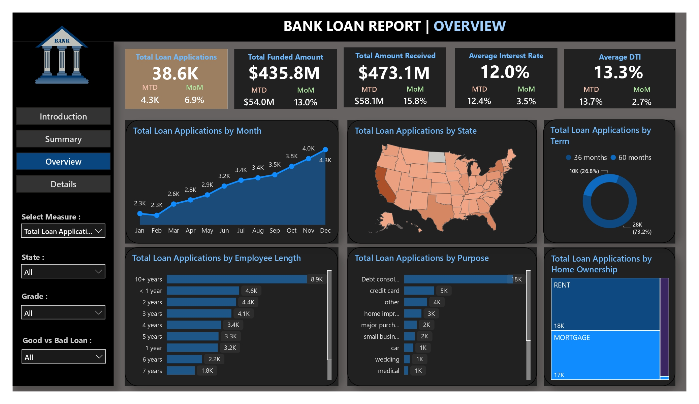
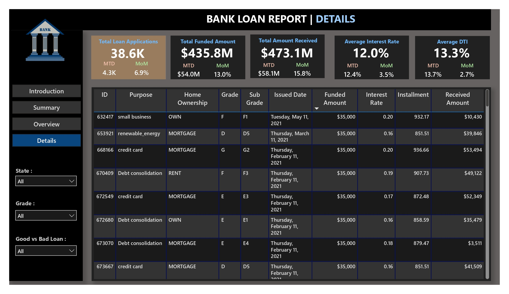

<p align="center">

&nbsp; 

</p>


\# 🏦 Bank Loan Insights — Power BI Project


\## 📌 Overview

This project delivers \*\*data-driven insights into bank loan performance\*\* using \*\*Power BI\*\*.  

It leverages a structured financial loan dataset and builds interactive dashboards to analyze borrower behavior, repayment performance, risk segmentation, and profitability.  


The objective is to \*\*empower stakeholders\*\* with actionable intelligence for \*\*credit risk management, loan approval strategies, and revenue optimization\*\*.


---


\## 📂 Project Structure


Bank Loan Insights/

│── analytical\_BI\_report.pdf # Exported BI report in PDF format

│── bank\_loan\_data\_insights (1).pbix # Power BI dashboard file

│── financial\_loan.xlsx # Raw loan dataset

│── bank\_logo.jpg # Project branding/logo

│── overview.jpg # Overview dashboard screenshot

│── details.jpg # Detailed insights dashboard screenshot

│── summary.jpg # High-level summary dashboard screenshot

│── README.md # Project documentation


---


\## 📊 Dataset Description


\- \*\*Source File\*\*: `financial\_loan.xlsx`  

\- \*\*Records\*\*: ~38,500  

\- \*\*Attributes\*\*: 24 (borrower profile, loan details, repayment behavior, credit scores, etc.)


\### Key Columns

\- `loan\_amount` → Original loan principal issued  

\- `int\_rate` → Interest rate charged  

\- `installment` → Monthly installment  

\- `loan\_status` → Repayment outcome (Fully Paid, Charged Off, Current, etc.)  

\- `annual\_income` → Reported borrower income  

\- `dti` → Debt-to-Income ratio  

\- `grade`, `sub\_grade` → Credit grade assigned  

\- `emp\_length` → Borrower’s employment length  

\- `home\_ownership` → Rent, Mortgage, Own, etc.  

\- `address\_state` → Borrower’s state of residence  


---


\## 🎯 Business Objectives


\- \*\*Portfolio Health Monitoring\*\* → Loan performance by repayment status.  

\- \*\*Revenue \& Risk Analysis\*\* → Loan amount issued vs. payments collected.  

\- \*\*Borrower Segmentation\*\* → Income, employment, home ownership, geography.  

\- \*\*Credit Risk Evaluation\*\* → Default rate by grade, DTI, interest rate.  

\- \*\*Geographical Risk Mapping\*\* → Regional loan exposure \& charge-off trends.  


---


\## 📈 Dashboards \& Reports


\### 🔹 1. Overview Dashboard

High-level KPIs and loan performance metrics.  

<p align="center">

&nbsp; 

</p>


---


\### 🔹 2. Detailed Insights

Loan distributions, borrower segmentation, repayment performance.  

<p align="center">

&nbsp; 

</p>


---


\### 🔹 3. Summary Dashboard

Concise insights for management-level reporting.  

<p align="center">

&nbsp; 

</p>


---


\## 📑 Reports


\- 📄 \[Analytical BI Report (PDF)](analytical\_BI\_report.pdf)  

\- 📊 \[Interactive Power BI Dashboard (.pbix)](bank\_loan\_data\_insights%20(1).pbix)  


---


\## 🛠️ Tools \& Technologies


\- \*\*Data Storage\*\* → Excel dataset (`.xlsx`)  

\- \*\*Visualization\*\* → Power BI  

\- \*\*Data Transformation\*\* → Power Query (ETL)  

\- \*\*Languages\*\* → SQL, DAX  


---


\## 📌 Key Insights Delivered


\- 📉 Borrowers with \*\*higher DTI ratios\*\* → higher default probability.  

\- 🏷️ \*\*Grade E \& F loans\*\* → high risk but higher interest returns.  

\- 🏠 Renters with \*\*<1 year employment\*\* → elevated charge-off rates.  

\- 🌍 Certain \*\*states\*\* → higher delinquency patterns (regional risk).  


---


\## 🚀 How to Use


1\. Clone this repository:  

&nbsp;  ```bash

&nbsp;  git clone https://github.com/dev-iz/Bank-Loan-Insights.git


Navigate to the Bank Loan Insights folder.


Open the .pbix file in Power BI Desktop for interactive analysis.


Review analytical\_BI\_report.pdf for a static version of insights.


Use financial\_loan.xlsx as the data source if reloading dashboards.


📢 Acknowledgement


This project is part of a broader BI Projects Collection showcasing end-to-end analytics workflows using Power BI.

